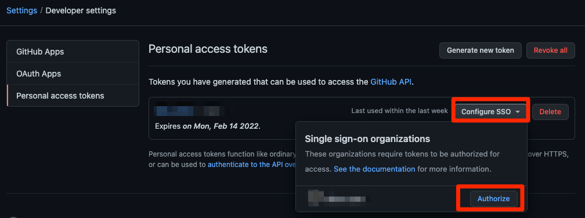

# github-issue-creator


CSVファイルのタイトルリストをもとに、Github issueを作成するだけのプロダクト.  
Zenhubを使っている場合は対象のファイルをEpicにすることもできる.  

# 動作環境
- Mac OS Big Sur version 11.4
- curl 7.64.1 
- jq 1.6

## 使い方
```
./github-issue-creator.sh -h
使い方: ./github-issue-creator.sh -o owner -r repo -f filepath
-o owner_name      : issue発行先のリポジトリの所有者.
-r repository_name : issue発行先のリポジトリ名.
-f filepath        : issueのタイトルリストのファイルパス.
-d debug           : デバッグモードで実行します.curlが失敗する際の原因究明にご利用ください.
-h                 : 本メッセージを出力.
```

## 例

1. Githubの個人トークンを発行する  
   参考: [個人アクセストークンを使用する
   ](https://docs.github.com/ja/authentication/keeping-your-account-and-data-secure/creating-a-personal-access-token#creating-a-token)

1. 発行したいGithub issueのタイトルを記述したファイルを用意  
   例:３つのチケットを作成したい場合
   ```Shell
   $ cat example.csv
   テストissue 1
   test issue 2
   test issue\n3
   ```

1. issueを作成する  
   例: https://github.com/kashiwaguma-hiro/github-issue-creator リポジトリへissueを発行したい場合
   ```Shell
   $ pwd
   /Users/kashiwaguma-hiro/git/github-issue-creator

   $ GITHUB_PERSONAL_TOKEN=1で発行したトークン \
     ./github-issue-creator.sh -o kashiwaguma-hiro -r github-issue-creator -f example.csv
   Create issue...done!

   $ cat created_issues_yyyyMMddhhmmss.log
   https://api.github.com/repos/kashiwaguma-hiro/github-issue-creator/issues/1
   https://api.github.com/repos/kashiwaguma-hiro/github-issue-creator/issues/2
   https://api.github.com/repos/kashiwaguma-hiro/github-issue-creator/issues/3
   ```

## トラブルシューティング
- 実行時に「 (22) The requested URL returned error: 403」と出力される場合はトークンの設定が間違っている可能性があります。
  - SSO連携しているアカウントで Organization リポジトリへ issueを登録する場合は認証が必要な場合があります
    - [個人トークンの設定画面](https://github.com/settings/tokens)
    - 

## 参考にさせていただいたサイト
- https://docs.github.com/ja/rest/guides/getting-started-with-the-rest-api
- https://docs.github.com/en/rest/reference/issues#create-an-issue
